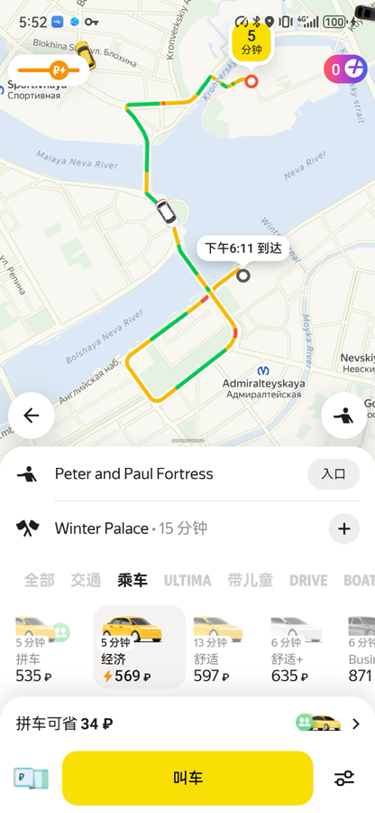
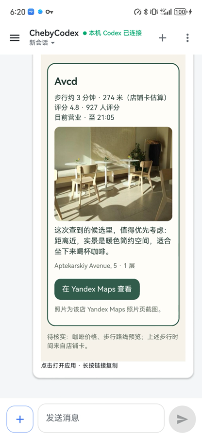

# ChebyAgent

ChebyAgent 是一个可以直接安装到 Android 手机上的本地 Agent。一个 APK 已经包含
Codex CLI、PRoot/Debian Linux 运行环境、手机控制工具和生活服务 Skills。普通用户不需要
安装 Termux，不需要连接 USB，也不需要在电脑上执行命令。

你在手机聊天界面里描述目标，ChebyAgent 可以读取当前页面、理解截图、打开并操作其他
App，并把结果带回同一个会话。模型推理由你选择的服务提供；模型凭证只在手机的
“服务与登录”页面填写，不要发到聊天里。

## 真实手机演示

以下是两段相互独立的 Huawei ALN-AL00 真机原始连续录屏。视频没有剪辑、裁切或打码；
录制前使用了公开地点和公开商户信息，因此不展示账号、支付资料或私人地址。

| 打车去冬宫 | 找附近的咖啡厅 |
|---|---|
| [](https://github.com/yangyanping7133-stack/chebyagent/releases/download/v0.7.3/ChebyAgent-0.7.3-Demo-Taxi-to-Winter-Palace.mp4) | [](https://github.com/yangyanping7133-stack/chebyagent/releases/download/v0.7.3/ChebyAgent-0.7.3-Demo-Nearby-Coffee.mp4) |
| **▶ [观看完整视频（1 分 47 秒）](https://github.com/yangyanping7133-stack/chebyagent/releases/download/v0.7.3/ChebyAgent-0.7.3-Demo-Taxi-to-Winter-Palace.mp4)** | **▶ [观看完整视频（9 分 10 秒）](https://github.com/yangyanping7133-stack/chebyagent/releases/download/v0.7.3/ChebyAgent-0.7.3-Demo-Nearby-Coffee.mp4)** |
| 输入中文“打车去冬宫”，展示 ChebyAgent 操作 Yandex Go，最后停在实时叫车确认页；没有下单。 | 输入中文“找附近的咖啡厅”，展示 ChebyAgent 操作 Yandex Maps，并回到会话展示完整咖啡厅报告；没有预订、致电或导航。 |

校验文件：[打车视频 SHA-256](https://github.com/yangyanping7133-stack/chebyagent/releases/download/v0.7.3/ChebyAgent-0.7.3-Demo-Taxi-to-Winter-Palace.mp4.sha256) ·
[咖啡厅视频 SHA-256](https://github.com/yangyanping7133-stack/chebyagent/releases/download/v0.7.3/ChebyAgent-0.7.3-Demo-Nearby-Coffee.mp4.sha256)

> 当前发布版：`0.7.3`。已在 Huawei ALN-AL00（Android 12、ARM64）完成覆盖安装、
> 冷启动、会话恢复、图片输入、手机移动网络和手机操作验证；Codex 与
> GLM 5.3 Flash 均已实际调用 Yandex Maps 完成附近咖啡厅搜索。工程最低
> Android 9；其他品牌和系统版本尚未逐一验证。

## 它能做什么

- 像普通聊天应用一样使用 Codex，并保留和恢复会话；
- 让模型查看你主动添加的图片，或在执行手机任务时读取当前屏幕；
- 打开 App，点击、滑动、输入文字、返回和等待页面变化；
- 使用内置 Skills 查地图、路线、餐厅、咖啡、超市、理发、按摩、宠物美容、租房、
  外卖和打车；
- 在付款、下单等敏感步骤前要求机主用指纹、面容或锁屏凭证确认；
- 在任务运行时显示最终结果；过程详情可以折叠，日常使用不需要一直盯着执行日志。

ChebyAgent 不是离线大模型：APK 内置的是 Codex CLI 和 Linux 运行层，模型回答以及地图、
租房、打车等在线服务仍需要网络。它也不会替你绕过验证码、账号登录、支付验证或 App
自身的安全限制。

## 安装前先确认

1. 手机是 ARM64，Android 9 或更高版本，并留有足够空间解压内置运行环境。
2. 手机能访问你准备使用的模型服务；GLM 需要 Z.AI API Token，ChatGPT/Codex
   使用套餐账号登录。
3. 手机上没有需要保留数据的 Termux。ChebyAgent 0.7.3 使用应用标识 `com.termux`，
   不能与正式 Termux 同时安装。若已有 Termux，先备份数据；不要直接卸载或清除。
4. 需要操作的目标 App 已安装，并由你本人完成账号登录、定位和必要授权。

## 下载和安装

1. 打开 [ChebyAgent 0.7.3 Release](https://github.com/yangyanping7133-stack/chebyagent/releases/tag/v0.7.3)，
   下载 `ChebyAgent-0.7.3.apk`。
2. 在同一页面查看 `SHA256SUMS`。APK 的 SHA-256 应为：

   ```text
   e0945173cf3d72947297dc040d26276e33fd7e03a6c24e4bb218a116f4330e44
   ```

3. 点开 APK。系统询问时，只给当前浏览器或文件管理器“允许安装未知应用”的权限；
   安装完成后可以关闭这项来源授权。
4. 打开 ChebyAgent，保持应用在前台，等待状态从“正在展开内置运行环境”或
   “正在离线安装内置 Codex”变为“请在更多菜单配置模型凭证”。首次初始化不需要下载
   Codex 或 Linux 运行包。
5. 如果初始化失败，先记下屏幕上的简短错误并重新打开应用。不要通过“清除数据”试错，
   因为这会删除会话和已保存设置。

华为手机可能连续显示安装来源和风险确认。只对上面这个已经核对版本与 SHA-256 的 APK
继续；不需要关闭锁屏、病毒扫描或其他系统安全能力。更完整的系统提示说明见
[手机安装指南](docs/architecture/ALN_PHONE_INSTALL_GUIDE.md)。

## 第一次使用

### 1. 配置模型服务

进入右上角 **更多（⋮）→ 服务与登录**，选择一种入口：

| 入口 | 怎么登录 | 默认设置 |
|---|---|---|
| GPT-5.6 Sol | 点“生成登录码”完成设备登录；也可点“导入登录文件”选择你自己的 Codex `auth.json`，然后保存并重连 | 新安装默认入口，高强度 |
| GLM 5.3 Flash | 填写 Z.AI API Token。普通 API 地址为 `https://api.z.ai/api/paas/v4`；Coding Plan 使用 `https://api.z.ai/api/coding/paas/v4` | 低强度 |

会话里的推理强度使用模型原生英文值：GLM 为 `low / high / max`；GPT-5.6 Sol
为 `none / low / medium / high / xhigh / max`。

点 **保存** 后，空闲状态会重新连接。若当前任务仍在运行，它会继续使用旧配置；任务结束后
再点 **更多（⋮）→ 应用已保存的模型配置**，或者重新打开应用。

“已保存”只表示配置已写入，不代表模型服务已经连通。已经保存的 Token 不会回显：输入框
留空会保留原值，勾选“清除已存凭证”并保存才会删除。更换服务地址时必须重新填写 Token，
旧 Token 不会被发送到新地址。

### 2. 开启手机控制

进入 **更多（⋮）→ 打开 ChebyNode 无障碍授权**，在 Android 的无障碍页面打开
**ChebyNode Control**。这个权限让 Agent 读取当前页面、截取屏幕并执行你请求的手势。

Android 11 及以上版本可直接通过无障碍服务截图；较旧版本可能出现系统录屏/截图授权，
按当前任务决定是否允许。系统升级、重启或覆盖安装后，如果手机工具不可用，先回到这里
确认服务仍然开启。

### 3. 保持敏感操作逐次确认

进入 **更多（⋮）→ 操作授权**。默认的“付款、下单免逐次确认”应保持关闭。这样当 Agent
准备点击付款、下单等敏感按钮时，手机会显示本次操作、目标 App 和当前页面信息；只有机主
点击“仅授权这一次”并完成系统身份验证后，任务才可以继续。

普通搜索、浏览和筛选不需要这项确认。除非你明确理解风险，不建议打开长期免确认。

### 4. 完成最小自检

1. 点右上角 **＋** 新建会话。
2. 发送：`用中文回答：2+2等于多少？`
3. 确认收到文字回答后，再发送：`打开 Yandex Maps，告诉我当前页面是什么。`
4. 确认目标 App 实际打开、页面被读取，并收到与屏幕一致的回答。

这四步分别验证模型登录、Codex 会话、手机工具和截图理解。只看到“保存成功”或 App 被打开，
不能说明完整链路已通过。

## 日常怎么用

直接说目标和限制即可，条件越具体越好。例如：

- `找附近评分高、安静、适合带电脑办公的咖啡厅，先给我三个候选。`
- `打开 Yandex Maps，规划到冬宫的步行路线。`
- `找今天营业的男士理发店，离我不超过 3 公里。`
- `在 Cian 找一套月租不超过 10 万卢布的两居室，先比较，不要联系房东。`
- `帮我打车去冬宫，车型选 Business，看到实时价格后停下来让我确认。`
- `帮我选晚餐，预算 2500 卢布，放进购物车后不要下单。`

需要让模型看相册图片时，点输入框左侧 **＋** 选择 PNG 或 JPEG，再附上问题发送。当前一条
消息最多 10 张图片、单张最多 8 MiB。手机任务中的当前页面截图由 Agent 按需获取，不需要
你反复手动上传同一屏幕。

任务运行时可以继续查看会话；需要终止时点 **停止本轮**。如果页面显示“送达未确认”，
不要马上重复发送可能下单或提交的指令：先重新进入该会话查看是否已有结果，再决定是否重试。

会话列表支持重命名、归档和永久删除。归档只是隐藏；永久删除无法恢复。

## 常见问题

| 现象 | 先检查什么 |
|---|---|
| 一直提示配置模型凭证 | 打开“服务与登录”，确认选中的入口确实已登录或已填写 Token，然后应用已保存配置 |
| 模型鉴权失败 | 检查 Token、服务地址、套餐/额度和手机网络；不要把完整 Token 或含凭证日志发到 Issue |
| 无法生成 ChatGPT 登录码 | 等本机运行环境连接完成后重试；登录页需要在另一台已登录 ChatGPT 的设备上打开 |
| 手机工具不可用 | 确认 ChebyNode Control 无障碍服务已开启，目标 App 位于前台且没有停在登录/验证码页面 |
| 地图读不到位置 | 同时检查 Android 定位权限、系统定位开关和地图 App 自身授权 |
| 图片无法理解 | 确认当前模型服务可用、图片是 PNG/JPEG 且清晰；重新选择失效的附件 |
| 任务一直运行 | 先点“停止本轮”；若连接中断，重新进入同一会话核对终态，不要盲目重复敏感操作 |
| 覆盖安装失败 | 确认新旧 APK 使用同一签名且版本不降低；不同签名不能原地更新 |

卸载 ChebyAgent 会删除 Android 私有数据。当前版本还不支持任意版本无损降级；更新前请保留
旧 APK、校验值并确认签名一致。

## 用户安全和隐私边界

- 模型 Token 存在 Android Keystore 保护的本机配置中，设置页禁止系统截图；但手机自身被
  root、同 UID 运行环境或恶意系统组件控制时，不能承诺绝对隔离。
- 仓库和正式 APK 不包含用户 Token、ChatGPT 登录材料、签名私钥、个人账号或手机数据。
- 验证码、账号登录、支付凭证和最终商业决定由用户本人处理。
- Agent 不能通过自己的手机控制工具替你打开“付款、下单免逐次确认”。
- 电话、短信、订单、预约和消息都有外部影响；发送前应在原 App 中再次核对对象、金额和内容。

发现安全问题时不要提交真实凭证、地址、手机号或未打码截图。先提供版本、手机型号、系统
版本、出现问题前后的非敏感状态和可复现步骤。

## 仓库结构

| 路径 | 作用 |
|---|---|
| `Android/appliance/` | 生成最终单 APK，组合 UI、ChebyNode、Termux、Linux 和 Codex |
| `Android/app/` | 对话 UI、Codex app-server 客户端、会话恢复和结果渲染的共享源码 |
| `Android/phoneNode/` | 无障碍、截图、手势与敏感操作授权的共享源码 |
| `Android/embedded/` | 将共享 Android 源码以库模块装入 appliance；不是另一套产品实现 |
| `third_party/termux-app/` | 固定版本的 Termux 上游源码 |
| `connector/` | PhoneBridge、本地 MCP 和 ACE 记忆适配 |
| `skills/` | 随 APK 提供的手机任务 Skills |
| `gateway/`、`relay/`、`deploy/` | 保留的分布式/服务器模式，不是 0.7.3 纯手机使用的必需项 |
| `tools/` | 本地构建、静态检查、来源库存和发布核验工具 |
| `contracts/`、`fixtures/` | 协议定义与测试夹具 |
| `docs/` | 架构、验收、发布和许可证据 |

更详细的模块依赖和维护边界见
[仓库结构说明](docs/architecture/REPOSITORY_STRUCTURE.md)。

## 从源码构建

普通用户不需要构建。开发者需要 JDK 17、Android SDK 35、NDK 27.2.12479018，以及
`Android/appliance/runtime/runtime.lock` 中锁定的 ARM64 运行资产。把 Release 中对应的
binary-input 资产放入文档指定位置后，在本地或受控项目设备上运行：

```bash
cd Android
./gradlew :app:testStandaloneUnitTest :appliance:testDebugUnitTest :appliance:assembleRelease
```

完整输入、对应源码和签名边界见
[Release 与对应源码说明](docs/RELEASE_AND_CORRESPONDING_SOURCE.md)。项目不使用 GitHub
Actions；GitHub 只保存源码和已经在本地核验的 Release 文件，不在托管运行器上编译、测试、
签名、打包或自动发布。

## 开源许可

项目自有代码按 [GPL-3.0-only](LICENSE) 发布，因为最终 Android appliance 派生并链接了
GPLv3-only 的 Termux app/shared 代码。Codex CLI、ACE、Android/JVM 依赖以及 Linux/Termux
包继续保留各自的上游许可证与归属。

对应源码、第三方声明和当前仍未关闭的审阅项见：

- [第三方软件与对应源码](THIRD_PARTY_NOTICES.md)
- [修改版安装、替换与重链接说明](INSTALLATION_INFORMATION.md)
- [许可与对应源码状态总览](docs/licensing/README.md)
- [组件库存](docs/licensing/COMPONENT_INVENTORY_20260905.md)
- [0.7.3 发布与对应源绑定](docs/RELEASE_SOURCE_BINDING_0.7.3.md)
- [0.7.0 历史合规审计](docs/licensing/RELEASE_COMPLIANCE_AUDIT_0.7.0.md)
- [0.7.0 历史证据调和结果](docs/licensing/RELEASE_COMPLIANCE_RECONCILIATION_0.7.0.json)
- [Release 与对应源码策略](docs/RELEASE_AND_CORRESPONDING_SOURCE.md)

这些材料是可复核的工程证据，不是法律意见。当前 367/367 个组件的许可证身份和全部
226 个运行组件的源码归档绑定已经调和；脚本没有自动生成法律结论。本项目仅公开发行
软件，不连同手机或其他硬件销售、出租或交付；实际发行方仍应根据自己的地区和发行模式
完成必要的法律复核。
